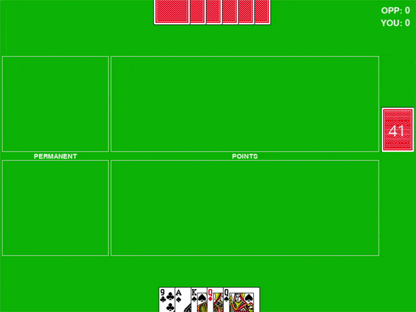

# Cuttle
> Fun 2-player card game using PyGame

[![Build Status][travis-image]][travis-url]

Cuttle is a 2-player combat card game played using a standard 52 card deck. The aim is to be the first build a layout worth at least 21 points. Cards can be used for their point value, or to attack your opponent's layout by destroying or capturing cards.

This implimentation of Cuttle was created using [PyGame](https://www.pygame.org/news).



## Rules

Read the rules for Cuttle on [Pagat.com](https://www.pagat.com/combat/cuttle.html)

## Installation

First, start by cloning the repository:

```
git clone https://github.com/MatthewFoulk/cuttle.git
```

I recommend using `virtualenv` for development:

- Start by installing `virtualenv` if you don't have it
```
pip install virtualenv
```

- Once installed access the project folder
```
cd src
```

- Create a virtual environment
```
virtualenv venv
```

- Enable the virtual environment
```
source venv/bin/activate
```

- Install the python dependencies on the virtual environment
```
pip install -r requirements.txt
```

- Start the game
```
python driver.py
```

Once these steps are successfully done, a new window will open with an instance of the
Cuttle game ready for you to play and enjoy!

## Meta

Matthew Foulk – [LinkedIn](https://www.linkedin.com/in/matthew-foulk-a7a24318a/) – matthewrfoulk@gmail.com

Distributed under the MIT license. See ``LICENSE`` for more information.

## Contributing

1. Fork it (<https://github.com/matthewfoulk/cuttle/fork>)
2. Create your feature branch (`git checkout -b feature/fooBar`)
3. Commit your changes (`git commit -am 'Add some fooBar'`)
4. Push to the branch (`git push origin feature/fooBar`)
5. Create a new Pull Request

## Extra

Start Date: 11/24/2020  
End Date: 12/1/2020  

This project was originally supposed to be my first partner project with my sister 
[Kelly Foulk](https://github.com/klfoulk16), but I made it my own (sorry Kelly, we
will have to do a different project). It was also supposed to have an AI player that
you could play against, unfortunately, that quickly proved outside my skill level at 
the moment.

This was my first time working with PyGame and GUI's in general. It was also my first project
in Python in a long while, not including CS50AI. I've been programming in Java for my 
undergraduate at the University of Maryland.

For the future, I would like to improve the general layout of both the Gui.py and
cuttle.py modules. They both became quite hectic as I continued to add more logic,
I even did a re-write on the play method and it still is that crazy looking. I would
also like to improve the modifications available to the user, such as the time between
turns, 9 and 4 usage, and the hand limit. At some point, it would be fun to create
an AI to play the game, but I believe that may require a rather large (read complete)
rewrite of this program.

One final note, you can tell where I slacked off (e.g. scoreboard, two-rebuttal, 
switching turns, etc) because it doesn't look pretty. At that time, I had finished all
of the fun parts of the project and was looking only to create a fully working
game.

<!-- Markdown link & img dfn's -->
[travis-image]: https://img.shields.io/travis/matthewfoulk/cuttle/master.svg?style=flat-square
[travis-url]: https://travis-ci.org/matthewfoulk/cuttle